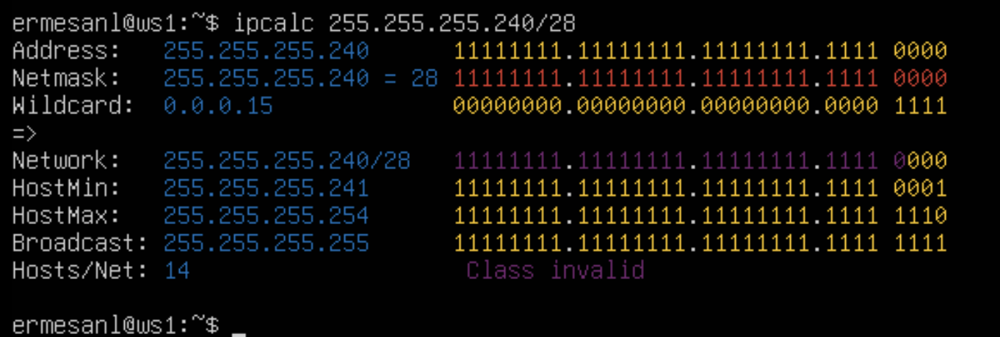
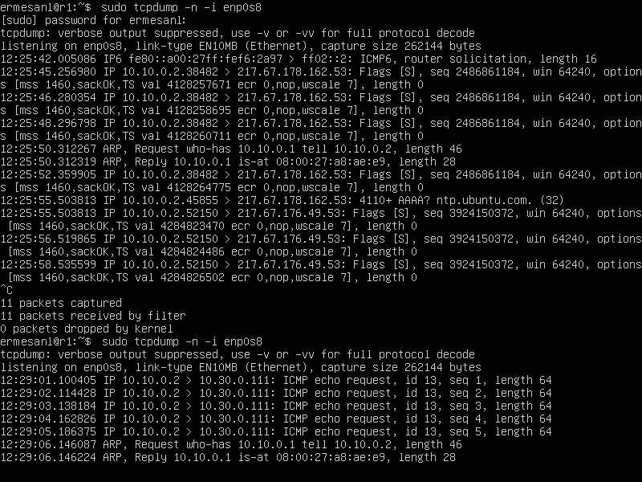
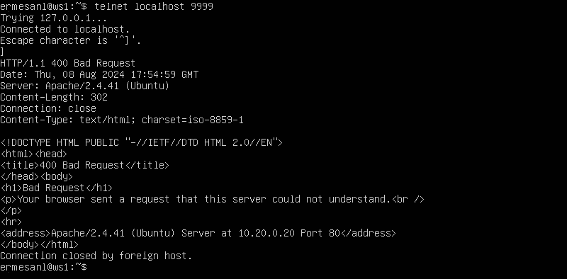

<h2>Part 1. Инструмент ipcalc</h2>

Подняли виртуальную машину на Ubuntu 20.04 Server LTS с именем ws11

Устанавливаем инструмент ipcalc командной `sudo apt install ipcalc`

*ipcalc* — это утилита командной строки для вычислений, связанных с IP-адресами и подсетями. Она помогает быстро и легко выполнять такие задачи, как определение маски подсети, сетевого адреса, диапазона доступных адресов и других параметров, связанных с IP-адресацией.

### 1.1. Сети и маски

Определяем и запишем в отчёт:
адрес сети 192.167.38.54/13 → 192.160.0.0/13 (Network)

Переведём маску 255.255.255.0 в префиксную и двоичную запись, /24 в обычную и двоичную и 11111111.11111111.11111111.11110000 в обычную и префиксную

Перевод маски 255.255.255.0 в префиксную(/24) и двоичную запись

Netmask: 255.255.255.0 = 24 11111111.11111111.11111111.00000000

/15 в обычную и двоичную

Netmask: 255.254.0.0 =15 11111111.11111111 0.0000000.00000000

11111111.11111111.11111111.11110000 в обычную и префиксную

Теперь запишем минимальный и максимальный хост в сети *12.167.38.4* при масках: /8, 11111111.11111111.00000000.00000000,255.255.254.0,/4

Минимальный и максимальный хост в сети минимальный и максимальный хост в сети 12.167.38.4 при маске /8 

Минимальный и максимальный хост в сети при маске 11111111.11111111.00000000.00000000

Минимальный и максимальный хост в сети при маске 255.255.254.0 

Минимальный и максимальный хост в сети при маске /4

### 1.2 localhost

Если приложение запущено на localhost, это означает, что оно функционирует именно на том компьютере, к которому задаётся запрос.

Для того, чтобы убедиться возможно ли обратиться к приложению, работающему на localhost, с IP адресами: 194.34.23.100, 127.0.0.2, 127.1.0.1, 128.0.0.1, пропингуем эти адреса:

Рабочие IP для приложений на localhost - 127.0.0.2 и 127.1.0.1

В итоге можно обращаться к приложению, работающему на localhost только со IP 127.0.0.2 и 127.1.0.1

### 1.3 Диапазоны и сегменты сетей

Частные IP-адреса используются внутри частных сетей, таких как домашние сети, корпоративные локальные сети и другие ограниченные сетевые инфраструктуры. Они предназначены для связи между устройствами внутри одной сети.

Публичные IP-адреса используются для уникальной идентификации устройств и сервисов в интернете. Они обеспечивают связь между устройствами по всему миру.

Какие IP можно использовать в качестве публичного, а какие только в качестве частных

1. *10.0.0.45 - частные
2. *134.43.0.2 - публичный*
3. *192.168.4.2 - частные*
4. *172.20.250.4 - частный*
5. *172.0.2.1 - публичный*
6. *192.172.0.1 - публичный*
7. *172.68.0.2 - публичный*
8. *172.16.255.255 - частный*
9. *10.10.10.10 - частные*
10. *192.169.168.1 - публичные*

Какие из IP адресов шлюза возможны у сети *10.10.0.0/18*

Посмотрим расчет сети с помощью `ipcalc 10.10.0.0/18`

*10.0.0.1 - невозможен*
*10.10.0.2 - возможен*
*10.10.10.10 - возможен*
*10.10.100.1 - невозможен*
*10.10.1.255 - возможен*

Шлюз должен иметь IP-адрес, который находится в том же диапазоне, что и IP-адреса устройств в данной сети

У сети *10.10.0.0/18*   возможны следующие IP адреса шлюза: *10.10.0.2, 10.10.10.10*, *10.10.1.255* (входят в диапазон

Адреса *10.0.0.1* и *10.10.100.1* являются частью другой сети.

<h2>Part 2. Статическая маршрутизация между двумя машинами</h2>

Подняли две виртуальные машины (ws1 и ws2)

Обе машины должны быть подключены к внутренней сети

С помощью команды `ip a` посмотриваем существующие сетевые интерфейсы

У машин по 3 интерфейса. Третий из них - для внутренней сети - не активирован

**lo (Loopback):** Этот интерфейс является "петлей обратной связи" и используется для локальных коммуникаций внутри самого устройства.

**enp0s5:** Это сетевой интерфейс, подключенный к виртуальной сети "NAT" в Parallels Desktop. Этот интерфейс используется для взаимодействия вашей виртуальной машины с внешним миром через NAT-маршрутизацию

**enp0s8:** Этот сетевой интерфейс находится в состоянии DOWN, что означает, что он не активирован

Активируем сетевой интерфейс на обеих машинах:
используя команду nano /etc/netplan/00-installer-config.yaml опишем сетевой интерфейс, соответствующий внутренней сети: добавляем адреса и маски для обеих машин

ws1 - 192.168.100.10, маска /16

*ws2 - 172.24.116.8, маска /12*

После внесения изменений вызываем команду `sudo netplan apply` , чтобы применить изменения, внесенные в конфигурационные файлы

С помощью команды `ip a` посмотрим существующие сетевые интерфейсы

ws1 - enp0s8 - настройки изменились

ws2 - enp0s8 - настройки изменились

### 2.1. Добавление статического маршрута вручную (маршруты не сохраняются после перезагрузки системы)

Добавим статический маршрут от одной машины до другой командой

Команда `ip r add` в Linux используется для добавления новых маршрутов в таблицу маршрутизации, что позволяет настроить, каким образом пакеты данных будут направляться к определённым сетям или хостам

Маршруты добавленные с помощью команды `sudo ip route add` не сохраняются после перезагрузки системы. Эти маршруты действуют только до следующего перезапуска системы или перезапуска сетевых сервисов.

На sw1 вводим команду `sudo ip r add 172.24.116.8 via 192.168.100.10 dev enp0s8`

Добавим статический маршрут до sw2

Тоже самое делаем и на sw2, с помощью команды `sudo ip r add 192.168.100.10 via 172.24.116.8 dev enp0s8`

Пропингуем соединение с помощью `ping -c 5` на обеих машинах

*ping ws1 - ws2*

*ping ws2 - ws1*

*Перезапустим машины sudo reboot*

### 2.2. Добавление статического маршрута с сохранением.

Перезапустим машины `sudo reboot` и добавим статический маршрут с сохранением от одной машины до другой с помощью файла etc/netplan/00-installer-config.yaml*

*добавим статический маршрут ws1 - ws2*

*добавим статический маршрут ws2 - ws1*

После внесения измененийп рименяем правила `sudo netplan apply` и пингуем соединение между машинами `ping -c 5`

*ping ws1 - ws2*

*ping ws1 - ws2*

<h2>Part 3. Утилита iperf3</h2>

### 3.1. Скорость соединения

Необходимо перевести и записать в отчёт: 8 Mbps в MB/s, 100 MB/s в Kbps, 1 Gbps в Mbps.

Чтобы перевести скорость из мегабитов в секунду (Mbps) в мегабайты в секунду (MB/s), нужно разделить значение в мегабитах на 8, так как в 1 байте содержится 8 битов.

Перевод мегабитов в секунду (Mbps) в мегабайты в секунду (MB/s) в одном байте содержится 8 битов:
8 Mbps == 1MB/s (/8)

Перевод мегабайтов в секунду (MB/s) в килобиты в секунду (Kbps):
Переводим мегабайты в мегабиты `100MB/s * 8 == 800Mbps` (в одном мегабайте (MB) содержится 8 мегабитов (Mb))
Переводим мегабиты в килобиты `800Mbps * 1 000 = 800 000Kbps` (в одном мегабите (Mb) содержится 1 000 килобитов (Kb))
100 MB/s == 800 000Kbps 

1 Gbps == 1 000Mbps (*1000) (1 Гигабит в секунду (Gbps) = 1 000 Мегабит в секунду (Mbps))

### 3.2. Утилита **iperf3**

Измерить скорость соединения между sw1 и sw2.

Устанавливаем утилиту iperf3 командой `sudo apt install iperf3`

sw1 будет выступать в роли сервера `iperf3 -s`

ws2 будет выступать в роли клиента `iperf3 -c 192.168.100.10`

<h2>Part 4. Сетевой экран</h2>

### 4.1. Утилита iptables

Создаем файл /etc/firewall.sh, имитирующий фаерволл, на sw1 и sw2

*создание файла /etc/firewall.sh на sw1*

*создание файла /etc/firewall.sh на sw2*

На sw1 напишем сначала запрещающее `iptables -A OUTPUT -p icmp --icmp-type echo-reply -j DROP`, а потом разрешающее правило на пинг `iptables -A OUTPUT -p icmp --icmp-type echo-reply -j ACCEPT`

Проверка, что правила добавлены (sudo iptables -L --line-numbers)

Запустим ping c sw2, увидим, что sw1 перестала пинговаться

Запустим ping c sw1 на sw2, увидим что пингуется

Обратную последовательность команд добавим для sw2 (в начале пишется разрешающее правило, а в конце пишется запрещающее правило)

Откроем на машинах доступ для порта 22 (ssh) и порта 80 (http)

`iptables -t filter -A INPUT -p tcp --dport 22 -j ACCEPT`
    
`iptables -t filter -A INPUT -p tcp --dport 80 -j ACCEPT`

Файлы /etc/firewall.sh

Запустим файлы на обеих машинах командами `chmod +x /etc/firewall.sh` и `/etc/firewall.sh`

Для sw1

Для sw2

### 4.2. Утилита **nmap**

Устанавливаем утилиту `sudo apt install nmap` .
Пингуем sw2 - sw1, видим, что отклика нет, после вызываем `nmap 192.168.100.10` и видим, что хост машины запущен

sw-2

Host is up

Сохраняем текущее состояние в интерфейсе Parallels Desktop
Cохранение дампов образов виртуальных машин

<h2>Part 5. Статическая маршрутизация сети</h2>

### 5.1. Настройка адресов машин

Поднимаем пять виртуальных машин: 3 рабочие станции (ws11, ws21, ws22) и 2 роутера (r1, r2)

ws11

ws21

ws22

r1

r2

Сохраняем результат с помощью `sudo netplan apply`

Командой `ip a` проверяем, что адреса машин заданы верно

ws11

ws21

ws22

r1

r2

Пропингуем ws22 с ws21

Пропингуем r1 с ws11.

### 5.2. Включение переадресации IP-адресов

Для включения переадресации IP, выполним команду на роутерах `sudo sysctl -w net.ipv4.ip_forward=1`

r1

r2

Откроем файл /etc/sysctl.conf и добавим в него строку
При выполнении вышеуказанной команды переадресация не будет работать после перезагрузки системы, поэтому в файле /etc/sysctl.conf  расскомментируем следующую строку - net.ipv4.ip_forward = 1

r1

r2

`net.ipv4.ip_forward = 1`*При использовании этого подхода, IP-переадресация включена на постоянной основе.*

### 5.3. Установка маршрута по-умолчанию

Настроим маршрут по умолчанию (шлюз) для рабочих станций, для этого добавим `default` перед IP роутера в файле конфигураций

ws11

ws21

ws22

Проверка, что маршрут добавился в таблицу маршрутизации  `ip r`

ws11

ws21

ws22

Для того, чтобы пропинговать с ws11 роутер r2,  используем команду используем команду `tcpdump -tn -i enp0s9`

Запускаем tcpdump на r2, чтобы отслеживать трафик на машине `tcpdump -tn -i enp0s9`

C ws11 начинаем пинговать r2  ping -c 5 10.100.0.12

На r2 видим, что запросы получены 

Роутер r2 получает запросы echo request , но ответ не отправляет, так как не прописан обратный адрес.

### 5.4. Добавление статических маршрутов

Добавили в роутеры r1 и r2 статические маршруты в файле конфигураций

для r1 шлюзом в сеть 10.20.0.0 будет 10.100.0.12

для r2 шлюзом в сеть 10.10.0.0 будет 10.100.0.11

С помощью ip r убедимся, что статический маршрут добавлен r1

С помощью ip r убедимся, что статический маршрут добавлен r2

Запустим команды на ws11:

Вызов команды `ip r list 10.10.0.0/18` выведет информацию о маршруте, связанном с конкретной подсетью

Для адреса 10.10.0.0/18 был выбран маршрутб отличный от 0.0.0.0/0, поскольку компьютер ws11 подключен к сети 10.10.0.0/18 через IP-адрес 10.10.0.2. Для всех остальных адресов используется маршрут по умолчанию, указанный в файле, который ведет к 10.10.0.1.

### **5.5. Построение списка маршрутизаторов**

Запускаем на r1 команду дампа `tcpdump -tnv -i enp0s8`

Опции -tnv указывают `tcpdump` отобразить вывод в числовом формате, без разбора имен хостов и портов, и включить подробную информацию о пакетах.

Запущена команда отслеживания сетевого трафика в реальном времени на r1

На ws11 запустили traceroute 10.20.0.10
Установка traceroute `sudo apt install traceroute`

Список маршрутизаторов на пути от ws11 до ws2

Утилита `traceroute` работает на основе отправки сетевых пакетов с заданным значением TTL и последующего анализа ответов от промежуточных узлов. TTL (Time To Live) определяет количество узлов, через которые пакет может пройти, прежде чем будет отброшен. Эта величина указывается в заголовке IP-пакета и предотвращает его бесконечное циркулирование в сети.

1. При запуске `traceroute` к определённому IP-адресу или доменному имени, утилита отправляет пакет с TTL, равным 1.
2. Первый узел в сети уменьшает TTL на 1. Если TTL становится равным 0, узел отбрасывает пакет и возвращает отправителю сообщение "Time Exceeded".
3. `traceroute` фиксирует информацию о первом узле, затем увеличивает TTL на 1 и отправляет новый пакет.
4. Этот процесс повторяется: каждый узел уменьшает TTL, и при достижении значения 0 отправляет сообщение "Time Exceeded". `traceroute` записывает данные о каждом узле.
5. Когда пакет достигает конечного адреса, он возвращает сообщение "ICMP Echo Reply" (при использовании протокола ICMP), указывающее, что пакет дошел до цели.
6. Утилита завершает работу, показывая список всех узлов, через которые прошли пакеты, и время, затраченное на прохождение каждого из них.

Таким образом, `traceroute` позволяет отследить маршрут, который пакеты данных проходят от отправителя к получателю через сеть, а также измерить задержки (пинг) на каждом промежуточном узле.

### 5.6. Использование протокола ICMP при маршрутизации

Запускаем на r1 перехват сетевого трафика `tcpdump -n -i enp0s8`

Запущена команда отслеживания сетевого трафика в реальном времени на r1

Пингуем с ws11 несуществующий IP с помощью команды `ping -c 1 10.30.0.111`

ping несуществующего адреса с ws11

Видим, что tcpdump отловил запрос 

tcpdump отловил запрос на r1

Сохраняем дампы образов виртуальных машин

<h2>Part 6. Динамическая настройка IP с помощью DHCP</h2>

Для r2 настраиваем в файле /etc/dhcp/dhcpd.conf конфигурацию службы DHCP

Чтобы появился файл, который будем редактировать нужно установить пакет `apt-get install isc-dhcp-server`.Утилита`isc-dhcp-server` позволяет настроить и управлять сервером DHCP, предоставляя IP-адреса и другие параметры клиентам.

В файле /etc/resolv.conf пропишем nameserver 8.8.8.8

Перезагружаем службу DHCP командой systemctl restart isc-dhcp-server  

У машины ws21 в конфиге /etc/netplan/00-installer-config.yaml для интерфейса enp0s8 включаем dhcp4: true , чтобы интерфейс запрашивал сетевую конфигурацию у DHCP-сервера (машины r2), и комментируем заданные настройки IP адреса

После этого перезагружает машину ws21 через sudo reboot

IP адрес интерфейса enp0s8 до применения настроек dhcp4: true

IP адрес интерфейса enp0s8 после запроса конфигурации у DHCP-сервера (машины r2) на ws21

Пингуем ws21 с ws22 

Настроим на машине r1 службу DCHP с жесткой привязкой к MAC-адресу (ws11)

Указываем MAC адрес у ws11, для этого в etc/netplan/00-installer-config.yaml надо добавить строки: macaddress: 10:10:10:10:10:BA, dhcp4: true

Выключаем машину и в настройках сети меняем MAC-адрес на новый

MAC-адрес, генерируется автоматически

MAC-адрес заданный вручную

Настраиваем r1 аналогично r2:

Устанавливаем утилиту `apt-get install isc-dhcp-server` для того, чтобы r1 смог выполнять функцию DHCP-сервера
Настраиваем в файле /etc/dhcp/dhcpd.conf конфигурацию службы DHCP

В файле /etc/resolv.conf пропишем nameserver 8.8.8.8

Перезагружаем службу DHCP командой systemctl restart isc-dhcp-server , на ws11 делаем `sudo reboot`

Проверяем, что у интерфейса enp0s8  ws11 изменился MAC-адрес и IP адрес

Пропингуем ws22 - ws21

Запросим с ws21 обновление IP адреса
Сначала проверим текущий адрес

Чтобы обновить или освободить IP-адрес для конкретного интерфейса, в нашем случае для enp0s8, необходимо ввести `sudo dhclient -r enp0s8` и `sudo dhclient enp0s8`

Первая команда освободит текущий IP адрес, а вторая запросит новый

Сохраняем дампы образов виртуальных машин

“Жесткая привязка к MAC-адресу” означает, что  DHCP-сервер назначает определенные IP-адреса и другие сетевые настройки для конкретных устройств (клиентов) в сети, исходя из их уникальных MAC-адресов. В обычной ситуации, DHCP-сервер назначает IP-адреса динамически клиентам в сети. Это означает, что каждый раз, когда устройство запрашивает сетевую конфигурацию у DHCP-сервера, сервер может назначить ему разный IP-адрес. Это удобно для многих устройств, но иногда бывает полезно иметь статический (постоянный) IP-адрес для определенных устройств.

Настройка DHCP-сервера с жесткой привязкой к MAC-адресу гарантирует, что каждый раз, когда устройство запрашивает сетевую конфигурацию, DHCP-сервер всегда будет назначать ему один и тот же IP-адрес.

<h2>Part 7. NAT</h2>

Установим утилиту apache2 `sudo apt install apache2` на ws22 и r1

В файле /etc/apache2/ports.conf на ws22 и r1 меняем строку Listen 80 на Listen 0.0.0.0:80, то есть делаем сервер Apache2 общедоступным

Запускаем веб-сервер командой service apache2 start

Добавим правила:
Удаление правил в таблице filter - `iptables -F`  
Удаление правил в таблице "NAT" - `iptables -F -t nat`  
Отбрасывать все маршрутизируемые пакеты - `iptables --policy FORWARD DROP`

Запустим /etc/firewall.sh: chmod +x /etc/firewall.sh и /etc/firewall.sh

Ping ws22 - r1 не проходит

Добавим еще правил:

Разрешить маршрутизацию всех пакетов протокола ICMP -`iptables -A FORWARD -p icmp -j ACCEPT`

После добавления команды ws22 пингуется с r1

ping ws22 - r1: после разрешения маршрутизации всех пакетов ICMP - проходит

Включим SNAT, а именно маскирование всех локальных ip из локальной сети, находящейся за r2 (сеть 10.20.0.0)

Разрешаем маршрутизацию всех TCP-пакетов на 80 порт - `iptables -A FORWARD -p tcp --dport 80 ACCEPT`

Разрешаем маршрутизацию для пакетов с уже установленным соединением -  `iptables -A FORWARD -p tcp -m state --state ESTABLISHED -j ACCEPT`  

Изменим исходящий IP адрес для пакетов из сети 10.20.0.0/26 - `iptables -t nat -A POSTROUTING -s 10.20.0.0/26 -o enp0s8 -j SNAT --to-source 10.100.10.12`

Включим DNAT на 8080 порт машины r2 и добавить к веб-серверу Apache, запущенному на ws22, доступ извне сети

Когда пакеты приходят на внешний интерфейс маршрутизатора или брандмауэра, DNAT перенаправляет их на другой внутренний IP-адрес, который может быть размещен внутри локальной сети - `iptables -t nat -A PREROUTING -i enp0s8 -p tcp --dport 8080 -j DNAT --to-destination 10.20.0.20:80`

Итоговый файл firewall.sh на r2

Проверим соединение по TCP для SNAT, предварительно отключив в конфиге ws22 интерфейс NAT (и сохранив изминения `sudo netpla apply`)

Командой telnet 10.10.0.1 80 тестируем соединение ws22 с r1

Проверка соединения ws22 - r1, порт 80

Проверить соединение по TCP для DNAT командой telnet 10.20.0.20 8080

Проверка соединения  r1 - ws22, порт 8080

Сохраним дампы образов виртуальных машин

<h2>Part 8. Дополнительно. Знакомство с SSH Tunnels>

Запускаем на r2 firewall.sh

Установили Apache на ws22 sudo apt install apache2 и запустили веб-сервер только на localhost:80

Запустили веб-сервер только на localhost ws22

Cтавим ssh сервер  на ws21 и ws22 `sudo apt-get install openssh-server`

Отключаем NAT на всех машинах

Подключаемся по *Local TCP forwarding* с ws21 до ws22

Запустим веб-сервер `service apache2 start` на ws22

Подключаемся с ws21 к веб-серверу ws22 `ssh -L 333:localhost:80 ermesanl@10.20.0.20`

Подключились по ssh ws21-ws22

Нажимаем cmd + F2 , чтобы переключиться во второй терминал на машине ws21 и вводим команду telnet 127.0.0.1 333

Проверка соединения ws21 - ws22

Подключаемся по *Remote TCP forwarding* c ws22 до ws11

На ws22 пишем команду `ssh -R 9999:localhost:80 ermesanl@10.10.0.2`

Подключились по ssh ws22 - ws11

На ws11 проверяем соединение telnet localhost 9999

Делаем дампы образов виртуальных машин
